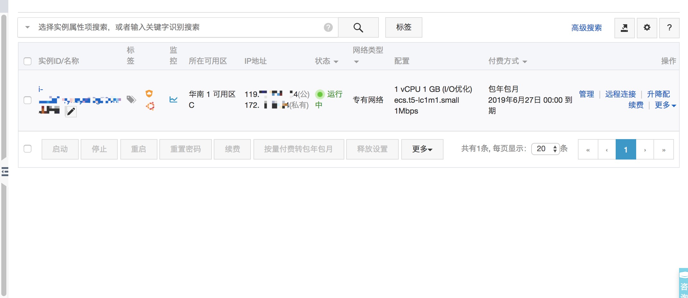

# 云服务器
#### 购买云服务器
为了部署项目，专门买阿里云的ECS云服务器。

根据自己的需求购买相应的配置，推荐自定义配置购买，比较优惠

1. 系统镜像，推荐使用 Ubuntu 14.04 64位
2. 系统配置，使用自定义密码，账号默认为root（远程连接输入）。

购买成功之后呢，去到控制台查看实例。


复制公网的地址： 119.XX.XXX.XXX

#### 连接到服务器
window连到服务器，推荐使用 putty

mac连到服务器，使用自带的终端

接下来，我们用mac自带的终端连到服务器

在终端输入连接到服务器的命令：
```
ssh root@119.XX.XX.XXX
```
接下来，会弹出输入密码，由于上面创建实例的时候，选择自定义密码,输入自定义的密码
```
root@119.XX.XX.XXX's password: 
```
终端看到以下信息，说明登录成功！
> Welcome to Alibaba Cloud Elastic Compute Service !

如果你购买的时候，并未自定义密码，可以去云服务器ECS的实例中，重置密码


选错系统盘，或者遇到问题（小白）
就更换系统盘，选择相应的系统即可，同系统盘不需要收费。

#### nvm node版本管理工具
[nvm](https://github.com/creationix/nvm)主要管理node的版本

##### 安装 nvm
```
sudo apt-get install vim wget curl
```
遇到无法安装的时候，需要update一下
```
sudo apt-get update
```

从[官网](https://github.com/creationix/nvm)中安装nvm有curl和wget的方式
```
curl -o- https://raw.githubusercontent.com/creationix/nvm/v0.33.11/install.sh | bash
```
```
wget -qO- https://raw.githubusercontent.com/creationix/nvm/v0.33.11/install.sh | bash
```
我们选用wget方式，在终端输入 wget的命令，回车

(安装完之后，建议新建新的终端，重新连接到服务器)


终端中，输入以下，下载对应node版本命令
```
nvm install v8.11.3
```

使用v8.11.3版本
```
nvm use v8.11.3
```

默认使用v8.11.3版本
```
nvm alias default v8.11.3
```

选择对应的node版本，国内的npm下载比较慢,推荐淘宝镜像下载
```
npm --registry=https://registry.npm.taobao.org install -g npm
```
或者下载cnpm
```
npm --registry=https://registry.npm.taobao.org install -g cnpm
```

新建个 app.js 文件，实现 Hello World
```
vi app.js
```
切换英文输入法，按下 i  ，切换输入模式
```
const http = require('http')

http.createServer(function(req, res){
    res.writeHead(200, {'Content-Type': 'text/plain'})
    res.end('hello world , my first server!')
}).listen(3000)

```
编写简易的服务器之后，按 esc键， 按下 :wq! 保存并退出

执行启动服务器命令
```
node app.js
```

在浏览器输入你的阿里云的公网地址 [http://119.XX.XXX.XXX:3000]()


