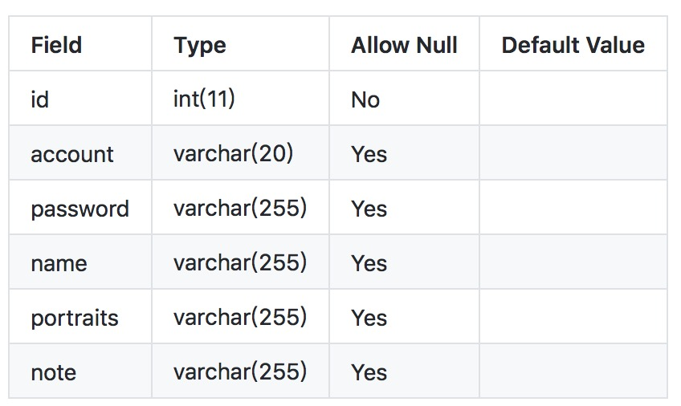
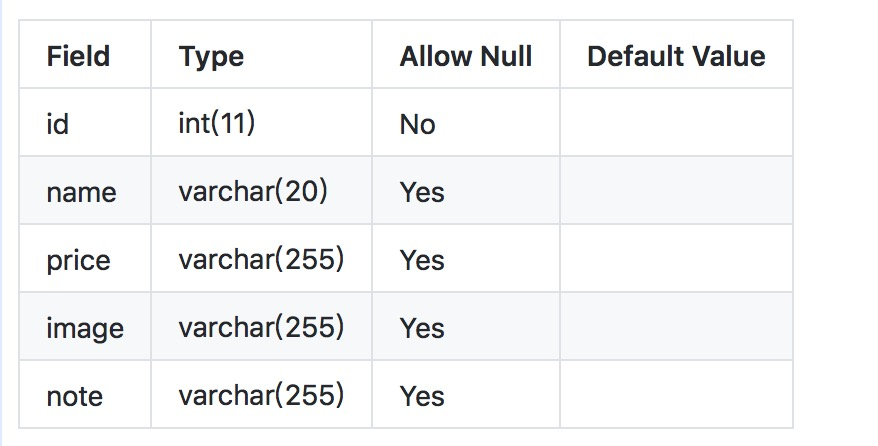

## 数据库表(一)

#### 数据库表关系
用户表 user



商品表 goods



购物车 cart


购物车作为用户表和商品表的关系表，userid和goodsid关联

新建 models/goods.js
```
import { Entity, Type } from '../config/db'

export default Entity('goods', {
  id: {
    type: Type.INTEGER(11),
    allowNull: false,
    primaryKey: true,
    autoIncrement: true,
    comment: '主键'
  },
  name: {
    type: Type.STRING(255),
    comment: '商品名称'
  },
  price: {
    type: Type.DOUBLE(10, 2),
    comment: '价格'
  },
  image: {
    type: Type.STRING(255),
    comment: '图片'
  },
  note: {
    type: Type.STRING(255),
    comment: '备注'
  }
}, {
  freezeTableName: true,
  timestamps: false
})
```
新建 models/cart.js
```
import { Entity, Type } from '../config/db'

export default Entity('cart', {
  id: {
    type: Type.INTEGER(11),
    allowNull: false,
    primaryKey: true,
    autoIncrement: true,
    comment: '主键'
  },
  userid: {
    type: Type.STRING(255),
    comment: '用户id'
  },
  goodsid: {
    type: Type.STRING(255),
    comment: '商品id'
  },
  valid: {
    type: Type.BOOLEAN(),
    allowNull: false,
    defaultValue: true,
    comment: '是否有效'
  },
  note: {
    type: Type.STRING(255),
    comment: '备注'
  }
}, {
  freezeTableName: true,
  timestamps: false
})
```

为了测试商品，新增 data-init/goods.js 测试数据
```
// 商品
export const goods = [
  {
    id: 1,
    name: 'OPPO R15',
    price: '',
    image: 'https://img10.360buyimg.com/n2/s240x240_jfs/t21784/243/1196660052/161862/f6cd60b6/5b2234c8Na7be7d3c.jpg!q70.jpg',
    note: ''
  },
  {
    id: 2,
    name: '华为 Mate 9 Pro',
    price: '',
    image: 'https://img10.360buyimg.com/n2/s240x240_jfs/t3985/131/486256904/433682/1d9fc4d0/584fcc81N1a31a2c5.jpg!q70.jpg',
    note: ''
  },
  {
    id: 3,
    name: '小米（MI） 小米MIX2',
    price: '',
    image: 'https://img14.360buyimg.com/n2/s240x240_jfs/t7423/194/3204708762/379719/b21a9fc1/59bb872eNf44497eb.jpg!q70.jpg.webp',
    note: ''
  }
]
```
修改 data-init/index.js , 初始化数据
```
export { user } from './user'
export { goods } from './goods'
```
执行 数据库初始化数据 npm run dbInit

可以看到控制台，判断是否初始化数据成功！